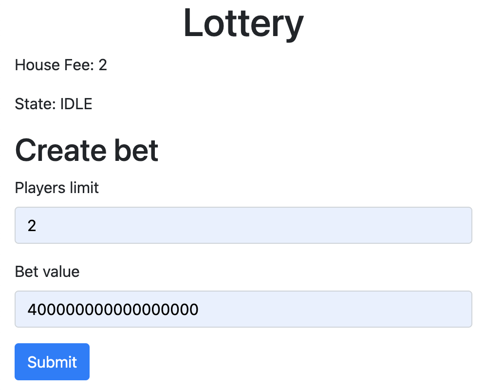
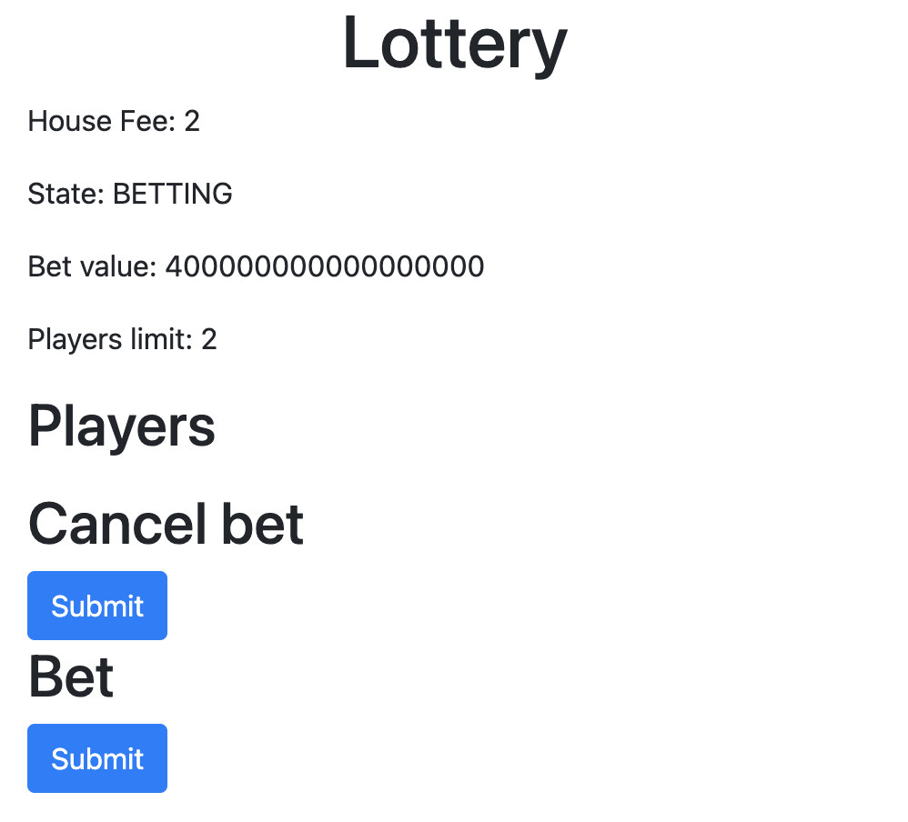

# Lottery Contract/DApp

## Contract deploy
1. Go into smart-contracts folder
1. Install project dependencies `npm i`
1. Run migration script `MNEMONIC="admin seed phrase" npm run migrate-bsc`

## Wallet configuration
1. Get some ether from [Binance faucet](https://testnet.binance.org/faucet-smart)
1. Switch to BSC testnet network on your wallet - [instructions](https://academy.binance.com/es/articles/connecting-metamask-to-binance-smart-chain)

## DApp usage
1. Go into frontend folder
1. Install project dependencies `npm i`
1. Start the dApp `npm run start`
1. Use your browser and go to [localhost:3000](http://localhost:3000/)

***

***

### Resources
* [Julien Klepatch](https://eattheblocks.com/)
* [Stephen Grider](https://www.udemy.com/user/sgslo/)
